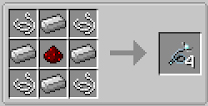

To get started with BM, you need to gather a few Demonic Wills. There are 2 ways to obtain Demonic Wills:

1. A hostile mob has been snared and is killed when white particle effects appear.
2. Killing a hostile mob with a Sentient weapon (more on this later).

Since you are just starting in BM, you do not have access to Sentient weapons. Craft a few snares. These are made with string, Redstone and iron (this recipe may be different in your mod pack). A single craft will give you 4 snares:

You can place the snare in your offhand, and a weapon in your main hand to make things easier. Right-click with a snare in your hand to throw it.

Once you have hit a mob with a few, wait until white swirling particles start to appear. These may not appear after the first snare; snares will not damage the mob:

If a mob dies from another source, such as falling or fire damage while it has the white swirl particles, it will still drop Demonic Will. 

Once these white swirls appear, you can safely kill the mob and it may drop a Demonic Will.

You will notice that the Demonic Will does not stack and that each Demonic Will has a quality attached to it. These can vary but are currently not important, even if you get a few with low stats (like 1.3) you can still use them. However, anything below 1 is not worth keeping. For now, collect as much as you can with the number of snares you have and then head back home

>>> Note: Mobs with higher health will drop Demonic Will with higher Will Quality, Endermen will have more than spiders, etc.
