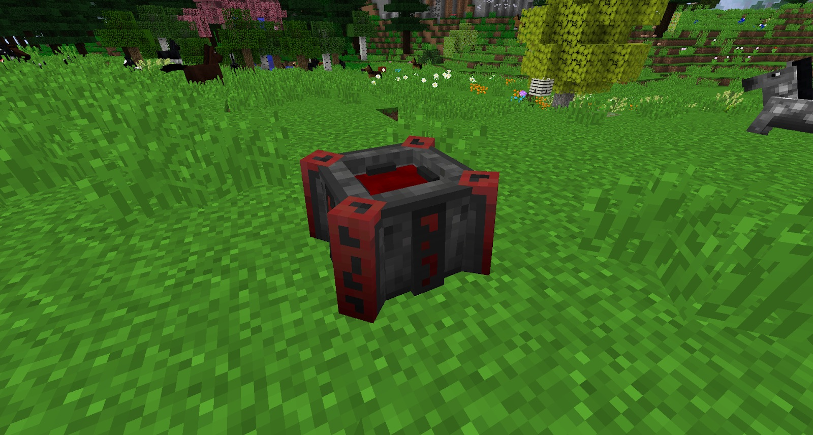
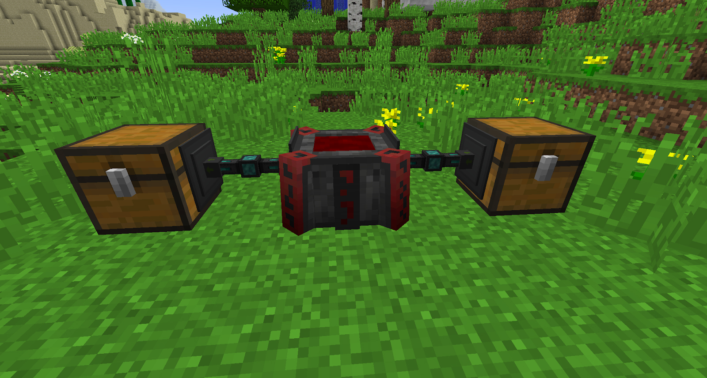

The Blood Altar will require a Demonic Will, Gold, Stone and a furnace to craft (this may vary depending on your mod pack). Once crafted you can place it down in the world, it is a good idea to have a whole room dedicated to this altar because as you progress through the mod the Altar will need a bigger and bigger “base” as it goes up in tiers. 

There are 6 Tiers to the Blood Altar and at its biggest, it will be 17x17x 8 in size.

Tier one is simply the Blood Altar on the ground, there is nothing else needed to upgrade this Altar.

In order to make any use of the Blood Altar, we will need to fill it with blood. Blood is referred to as LP (Life Points) and it's what you spend in the Blood Altar to craft items. There are a few ways to fill your Blood Altar, you will use the altar for the rest of the mod so it’s a good idea to go over all the ways that you can generate LP.

Note: You do not have to stand right next to your Altar when trying to fill it up with LP.
If you have The One Probe installed you can look at the Altar and hold Crouch to see how much LP is in the Altar.

You will also notice that the Altar will fill up with red liquid the more LP you store in it. All tiers can only hold 10,000LP. To increase the capacity of the altar you will have to make Runes of capacity.

Later on down the line, you will be making lots of Slates, these are crafted by putting stone in the Altar (right-clicking) with the required amount of LP. This can become very tedious but can be automated:

Above is set up with one chest as the input (Right) and one as the output (Left). The output has a filter to only withdraw Blank Slates. This is a very simple method but can also get a little out of control, you need to ensure you have enough blood in the Altar for the amount of stone you put into the input chest. The Altar will pull out a max of 64 of the stones in the chest and craft all the blank slates at once. Hoppers can also be used for input. Note that, though multiple inputs can be inserted at once using this method, the LP cost of converting all inputs will need to be consumed before any will actually be converted. For example, if you insert an entire stack (64) of stone at once, the stack of blank slates will be produced, all at once, only once the LP requirement for 64x the cost of a single slate has been consumed, which naturally takes quite a while. Because of this, it may be wise to avoid inserting too many inputs at once, lest the process be interrupted (by premature item removal or running out of LP) and the LP cost of multiple products be wasted.  

### Pumping out/into the Altar

You can also pump Life Essence &#8321; out of the Altar, the Altar has 2 tanks, one I/O tank (for code reasons) and the visible tank (you see when looking into the Altar). 

The I/O tank exists so pipes are not super overpowered, without the I/O tank you could just have a buffer tank with a couple million LP worth of Life Essence and have an Altar full of speed runes do everything pretty much instantaneously. The I/O tank will be drained into and filled before LP stays in the main tank of the Altar the I/O tank can also be expanded with runes of capacity. The I/O tank makes it so there's no set value for transfer speed into the crafting tank but that it is modifiable and you have to actually think and plan rather than just plug in the tank that's connected to a super sacrifice Altar.

Altars can be pumped out of but without any modifier runes this will be at a rate of 20mb/t, and later on, the displacement rune will increase the amount of LP transferred per operation, each rune multiplies this by 1.2x, stacking multiplicatively. One rune will be 24LP, next would be 28.8LP 20 runes would be 767LP per operation.

&#8321; Life Essence is not the same as Blood, the Blood you get from cows or NPCs in the smeltery (from Tinkers’ Construct mod) is not the same as Life Essence and can not be put into the Altar

