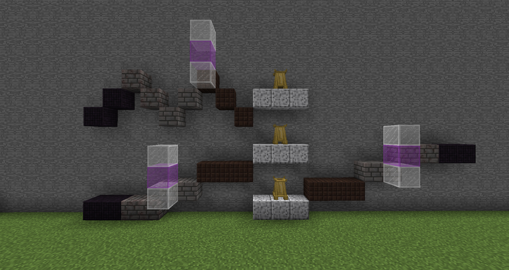
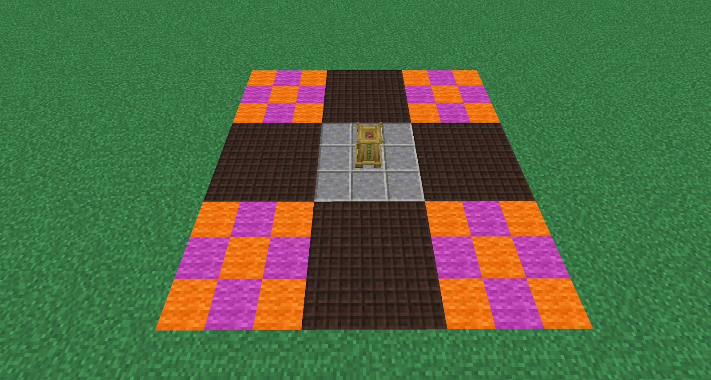

The Incense altar will help you when filling up your Blood Altar. With the apprentice Blood Orb you can now craft Wooden Paths. You will need to make 36, and place in a 3x3 square in each cardinal direction from the base of the Incense Altar. These blocks can be one higher or one lower than the previous level, as long as each side matches the pattern. Now, you can start adding different types of blocks to the 3x3 squares in each corner.

You can add these materials on the same level as the path blocks, and as much as 2 blocks higher. There are several materials you can use, and they each have different tranquillity types and values. The amount of actual Tranquility you get from each tranquillity type is a logarithmic scale, meaning the more of, say, Earth Tranquility you have, the less value each additional Earth Tranquility block will add. To get the most out of your altar, you'll need to vary the materials and types you use.  While it’s not too hard to hit the +60% cap with farmland and grass at Tier 1, especially at higher incense altar tiers expect to need to mix it up.

As you gain Tranquility, the bonus your altar gives you will increase, to a maximum of 60% using just wooden paths.

| Tranquillity Type | Block         | Value |
| ----------------- | ------------- | ----- |
| Crop              | Potatoes      | 1     |
| Crop              | Carrots       | 1     |
| Crop              | Wheat         | 1     |
| Crop              | Nether Wart   | 1     |
| Earthen           | Dirt          | 0.25  |
| Earthen           | Grass         | 0.5   |
| Earthen           | Farmland      | 1     |
| Fire              | Fire          | 1     |
| Fire              | Netherrack    | 0.5   |
| Lava              | Lava          | 1.2   |
| Plants            | Leaves        | 1     |
| Tree              | Logs          | 1     |
| Water             | Water         | 1     |
| Water             | Flowing Water | 1     |
| Water             | Life Essence  | 1.5   |

The orange and purple wool are areas that you can use any of the above materials. Remember to keep using the Altar! 
