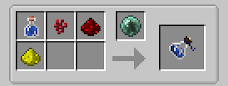

With the Apprentice Blood orb you will be able to craft a few new things in the Alchemy Table. You can still use the Apprentice Blood Orb to craft any recipes that were available with the Weak Blood orb. Each potion costs LP to produce.

* Neurotoxin
	* This is used later on when you have the Magicians Blood Orb (more on this later)

Now that you have the apprentice orb the Alchemical Table can also be used to make potions, now this process is slightly different to traditional means but it also does have its advantages. These are not potions per se and are more like flasks with multiple uses. Each potion still needs its ingredients but instead of putting them in one at a time (Nether Wart > Redstone>Glowstone) you can put them in all at once. 

The base of each potion will first need a Potion Flask, this will require the Apprentice Blood Orb and at least 100LP in your network.

This flask is the base of all potions and once a potion is brewed it will have 8 uses! Now that you can create a base it's time to start making potions. These potions are all the exact same as vanilla potions but they have 8 uses.

The following initial potions will last 2 minutes, with the exception of the Regeneration and negative effect Flasks, which only last 22 seconds.

| Ingredients | Effect |
| ------ | ----------- |
| Ghast Tear   | Regeneration |
| Golden Carrot | Night Vision |
| Magma Cream    | Fire Resistance |
| Water Bucket    | Water Breathing |
| Sugar    | Speed (+20% Speed) |
| Glistering Melon    | Instant Health |
| Spider Eye   | Poison |
| Ink Sac    | Blindness |
| Fermented Spider Eye    | Weakness (-4 Attack Damage) |
| Blaze Powder   | Strength (+3 Attack Damage) |
| Feather    | Jump Boost |
| Clay   | Slowness (-15% Speed) |
| Redstone  | Haste (+10% Speed) |
| Glass Bottle    | Invisibility |
| Poisonous Potato   | Saturation |
| Slime Block    | Bounce |
| String    | Cling |
| Cake    | Flight |
| Beetroot    | Deaf |

There is one potion that you can't make as you will have to progress to tier 3

Weak Blood Shard - Health Boost (+4 max Health)

This is covered later in the guide.

These potions can also be combined with Simple Power Crystal and Simple Lengthening Potion to make these potions more powerful and last up to 5:20 (or up from 22 seconds to 1 minute). Blood Magic also lets you combine flasks so one flask could have more than one effect on it, just by placing the flask into the Alchemy table as well as the desired ingredients!

