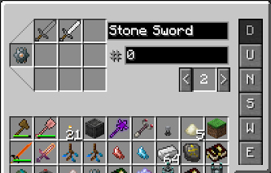

Blood Magic has its very own item routing system. This system is no match to an Applied Energistics network or a Storage Drawer system, but it doesn't need to be, it's simple and it works. Before jumping into item routing you need to understand the concept of each system.

Each system has a “Brain” (Master Routing Node) the brain talks to each node and ensures they are all communicating. These brains can only reach so far. Each brain can act as a separate system. In order to set these systems up you will also need a Node Router, this will act as your “wrench” and help configure each network.

When setting up an item routing system you will need to pull items into the system (Input Routing Node) so that it can output (output Routing Node) the items back into another location. Each system will also need a Brain (Master Routing Node).

### How things work
To connect Nodes together you need to right-click the Master routing node and then any input/output node you wish to connect to the network. Once linked successfully you will get a message and a white line that connects to the 2 nodes you have connected:

These lines only appear when you have the node router in hand.

Input and Output nodes will always connect to all the inventories that are stuck to them (up to 6), this can be configured when right-clicking the nodes and Selected either U (Up), D (Down), N S W E in the GUI.

Using Item Filters (Far left slot of the GUI), items can be filtered by NBT Data, Mod type, Precise items, Ore Dic and Liquids. Liquid filters will only transport 1 bucket of liquid at a time and only work with liquids that have a bucket form. Each item put into the grid will be a ghost item, so it won't take it out of your inventory. You can also select how many (# Box) of that item you wish to leave in(Input Node)/give to(Output Node) the inventory (0 means no limit) and what priority each inventory has (Toggle with the < and > arrows)

Nodes linked to a Master Routing node will talk to each other, other nodes linked to other separate Master Routing nodes will not talk to each other.

### Basic System
A very Basic system would be putting items from one inventory to another. First, we need 2 chests and a Master Routing Node, the Master Routing node does not have to be to close1 to the other nodes but it makes linking easier.

Next, we need to have a Node that will take the items out of the connected chest and that node will need to be connected to the Master Routing Node. Once connected the Input Node will automatically pull from any chest in its vicinity.

The final node is the output node, this will take the items out of our network and place them into the new chest (on the right). This will also need to be linked with Master Routing Node.

This is a basic system and only costs a little will to run.

>>>>> Nodes do not have a range limit but if you are stretching them over long distances it best to keep the chunks loaded that have the nodes, this works in theory but in reality, is very untested and could cause issues.
