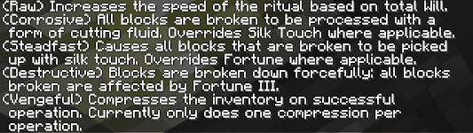
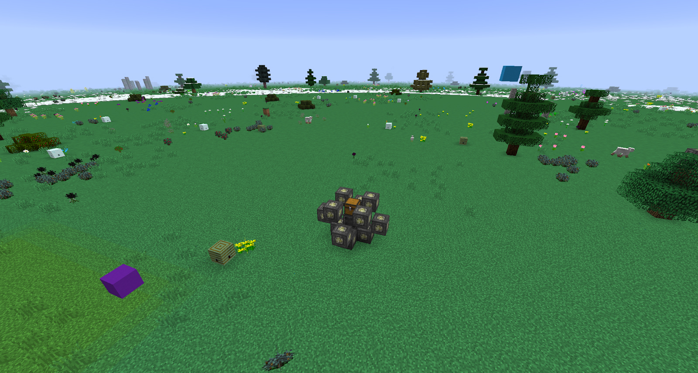

The ritual tinker does what the name implies, it will allow you to tinker with a ritual. Rituals can be modified in a few ways but not every ritual can be tinkered with. Rituals can be modified to consume Will and they can have their range increased amongst other things.

To fully grasp how the ritual tinkerer works this guide will cover examples with rituals, to find out more about these rituals please jump to this section that will give you more details such as activation cost and the rituals use.

With the ritual Tinkerer in hand you can right click to cycle through the ability of the Ritual Tinkerer, the ritual will need to be active in order for it to give you information, you will also need to right click in the air not pointing at any blocks:

### Information
Right clicking a Master Ritual Stone with the Ritual Tinkerer while on information mode will give you more details on the Ritual and will also tell you what effects different types of will have on a ritual.

Not every ritual will show you what different types of Will do.

### Consume Will
To modify a ritual to consume Will you will need to have a Will Crystal in your hotbar and then you can right click the master ritual stone with the ritual tinkerer, this will force the ritual to use a particular will from the Aura. Without the will in the Aura the ritual will continue as normal.

You can also add more than one type of Will to a Ritual and you can always add more types of will but this will require BOTH or ALL types of will that you want to add to the ritual.

You can also remove will usage from any ritual by right-clicking the Master Ritual stone with no will in your Hotbar.

Not all rituals can be modified to consume will.

### Define Area
Some rituals can have their area of effect move or changed and can also have their chest location moved. Shift right-clicking the Master Ritual Stone of an activated Ritual will either give you Chest location or Area (some give you an option to set will effect location, depending on the ritual). To select which one of these properties cycle through them by shift right-clicking the master ritual stone while on Define Area mode, once the area of effect shows up on screen you can start to select your first Location by using right-click, you can do the same to select the second location.

The best example of this is the Gathering of Forsaken Souls, this ritual has an area of effect around the ritual but this can be changed to just effect above, below the ritual or next to the ritual. 

You will need to mark out an area using 2 opposite positions. First, the Master Ritual Stone needs to be right-clicked (as this ritual does not have a chest requirement you will only be given one option to modify: Area) then the first marker of the area need to be right-clicked, a message will pop up confirming that the first marker has been set, next you will need to right-click the second marker, this need to be opposite in a diagonal pattern (like 2 corners of a square). These marks should be one level above the bottom, this means mobs in this 1 layer that we have marked out will take damage, setting the area on the floor will not work as there are no mobs in the floor:

Above you can see a Blue and a Purple stained glass, these are the 2 markers I have set, this whole level is where the ritual will effect, this till damages mobs but only in this area.

If you are trying to move the chest location you can simply put down any block to act as a placeholder for where the chest will be and then right-click it twice (remember to first right-click the Master Ritual Stone in Define Area mode and select chest location), then simply replace the placeholder with a chest. For some reason, you are not able to right-click a chest as it just opens and it does not save the location.

All the rituals in this guide will state whether or not they can be modified and what effects they have.

There are other rituals such as Call of the Zephyr that will collect items within its range. This can be changed to a max 9 block vertical and horizontal radius, below you can see how big this area is and how to define this area.

The purple block and the blue block are at different heights like 2 diagonal corners of a cube. Remember this when you are marking out big areas, the tinkerer will tell you after you have selected 2 blocks if the blocks you have selected are too far away from the Master Ritual Stone.