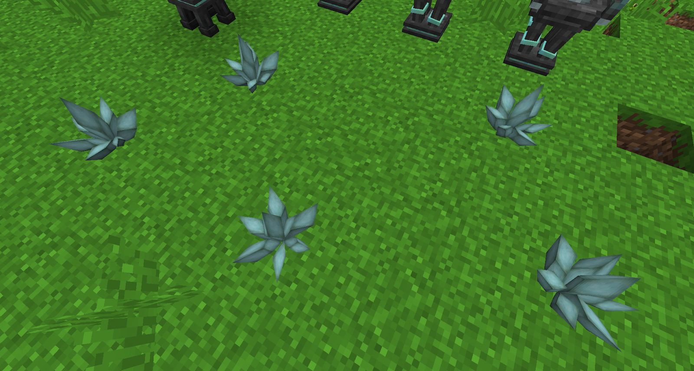

Up until now the only type of Will that is accessible is normal Demonic Will, there are however more types of will. Corrosive, Destructive, Vengeful and Steadfast Will are the other types of will that can be acquired, these other types of Will can be used in Rituals and can also be used with the Sentient weapons.

Before getting into how and what we can do with these other types of Will you will need to create some. In older versions of the mod, you had to plop a few Crystallizers down and wait for a different type of will to spawn. This now **DOES NOT WORK**.

### Resonance of the Faceted Crystal 
The only way to create these crystals is via the Resonance of the Faceted Crystal ritual, once built you will need to activate the ritual (this costs 20,000) and then put a Demon Crystallizer on top of the ritual stone. Next, you will need to ensure you fill the Aura with Will, this will slowly cause the Crystalizer to grow a normal demonic Will Crystal.

Once the crystal has grown 5 or more spires, the ritual will break off a crystal and place a new type of crystal on the floor on top of one of the 4 aspect stones around the Crystalizer. This will happen again and again but there is no guarantee that all 4 crystals will grow at the same time. The best thing to do is to wait until all 4 crystal wills have fully grown.

One of these rituals is more than enough and simply waiting for the crystals to grow to their full 7 spire size is recommended, even letting these crystals grow full 2 or 3 times is highly recommended. Keep the aura in the chunk full of normal Demonic Will, this will ensure the process works. 

Growing crystals in the Crystallizer and via the ritual is very slow and killing mobs for Will is also painful (unless you automate it), Will is needed more and more in rituals and for other things. 

Each of these new Will Crystals is worth around 100 will.

### Gathering of Forsaken Souls
Once you have enough of each type of will in crystal form you will need to create 1 Crystal Cluster of each type of will. These can be crafted in the Hellfire Forge and require a Tartaric Gem. These clusters can be placed on anything and will grow if there is the right amount of that type of Will in the Aura but at a VERY slow rate.

The Gathering of Forsaken Souls ritual will grow these crystals at an accelerated and cheaper rate by killing mobs, there will still need to be Will in the Aura but since mobs are being damaged the cost of growth will be greatly reduced and sped up. Note that the ritual has to kill the mobs, not just damage in order to be effective. Once the ritual is built it needs to be activated at a cost of 40,000LP, this ritual does have a running cost of 2LP per tick and mob it damages. Once activated it needs to be supplied with mobs ABOVE the ritual (this can be changed and redefined with the ritual tinkerer).

Once set up and running the ritual can have some of the spaces filled, don’t cover the ritual but it can be filled it so it runs flush with the ground.

Once filled in Will Crystals can be placed on the ground on the ritual, the more that are placed the better as long as you can keep the aura filled.

As the ritual runs the crystals will grow fully at an accelerated rate at the cost of a little Will in the Aura and LP. It's very advisable to wait for these crystals to fully grow (7 spines) so you can right-click these (with a Tartaric gem with at least 1,000 will in it) to pop off all the spines but leaving the main spine.

If you run out of Will or LP the ritual will stop. It is important to know that when the mobs die to this ritual they will still drop items, it’s very advisable to collect these items to reduce lag.

###Crack of the Fractured Crystal
Now that you have automated Crystal growth with all the different types of Will you can also automate the breaking of the Crystals (the act of right-clicking them). Breaking these crystals manually is not the most effective way, also if these crystals are not being harvested you are wasting LP and Will.

The Crack of the Fractured Crystal ritual can be placed below (or above, depends on where your mob farm is ) the Gathering of Forsaken Souls ritual by placing the Master Ritual Stone a few blocks Below (or above) the Master Ritual Stone of the Gathering of Forsaken Souls Ritual. It is strongly advised you place your mob farm for the Gathering of Forsaken Souls Ritual ABOVE the ritual, as the Crack of the Fractured Crystal fits nicely below the Gathering of Forsaken Souls Ritual

The Crack of the Fractured Crystal ritual will cost 40,000LP to activate and cost 50LP operation (operation being breaking of each crystal cluster), once activated the ritual will break shards off crystals without removing the centre shard. These shards will drop onto the ground and will need to be picked up, there is another Ritual for this but it's cheaper and more efficient to use other mods.

### Merging Rituals (for later, with the Veil of Evil)
Because of the similarity between Gathering of Forsaken Souls and Crack of the Fractured Crystal, one can merge them to use less Ritual Stones, either by using the previous set up and make the 4 Dusk Ritual Stones merge or by reversing it to merge the whole bunch of Fire Ritual Stones. With this second set up, one can also merge a not fully implemented Ritual: the Veil of Evil, which force the spawn of hostile mobs and could replace the mob farm if only its activation was effective… The merge is possible because the top of the Veil of Evil is made of 4 Dusk Ritual Stones in the same way as the bottom of the Gathering of the Forsaken Souls.

Here, you can see the 3 Rituals merged, with the Crystal range of the CFC and the Crystal range and the Damage range of the GFS. For now, the Veil of Evil seems to have an infinite range, however ineffective. So you can keep the idea of merging Rituals for this setup or others (do not try to merge the Master Ritual Stones, they can only handle 1 Ritual in a row), but this set up will still need a mob farm until the Veil of Evil is fully implemented. (The veil of evil does work you just need to use a tinkerer to set an area for it to effect)

