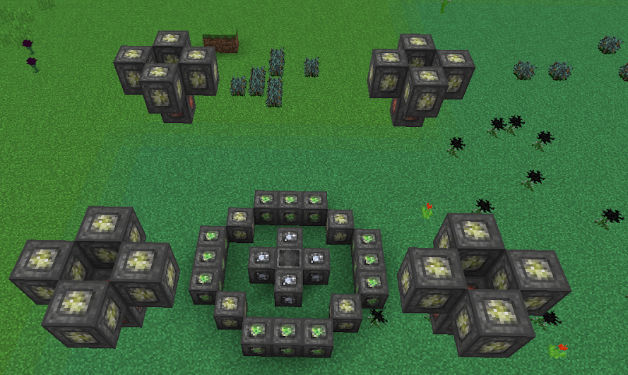

**Activation Cost**: 5,000LP  
**Cost Per ½ second**: 5LP  

This ritual will reduce fall damage down to 0 in a certain area. When near the ritual (25 block radius around the Master Ritual Stone)) you will gain a Feathered Buff for 1 second (this will keep refreshing). Falling into or near the ritual from great heights will apply the buff and negate fall damage.

This area can also be configured but it will need to be within a vertical range of 199 blocks and a horizontal range of 199 blocks of the  Master Ritual Stone.