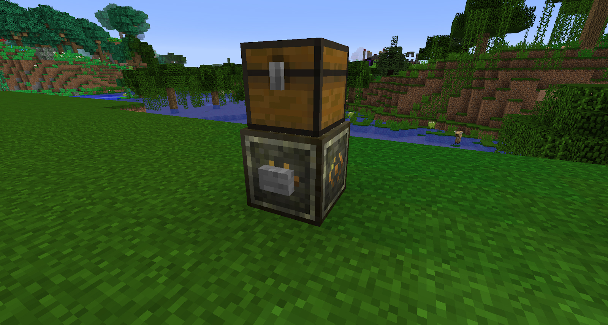

The Teleposer is a block that will act just like a teleporter but with the only limitation being that you need to apply a redstone signal and it needs to be linked to another Teleposer.

You will need to craft a few Teleposition Focus first, this can be done by placing an Ender Pearl into the Tier 4 Blood Altar with 2,000 LP. This can then be crafted together with gold and more ender pearls to make a Teleposer, you will need 2 of these for this to work.

Place down the first Teleposer, this will act as the primary Teleposer, this means once this is set up this block (the first one) will be given a redstone signal to send whatever block you have above it to the next Teleposer:

Place down your second Teleposer wherever you want to teleport the block (a chest in this case). Next you will need to use a Teleposition focus to bind the Teleposers. With the Teleposition focus in hand right click the first block and then do the same with the second block, once done right click the first Teleposer with an empty hand and place in the Teleposition focus.

Hit the button and watch the chest move to the other block. This is a very simple way to show what the Teleposer can do, you can also have 1 block on each block and they will also swap places.

