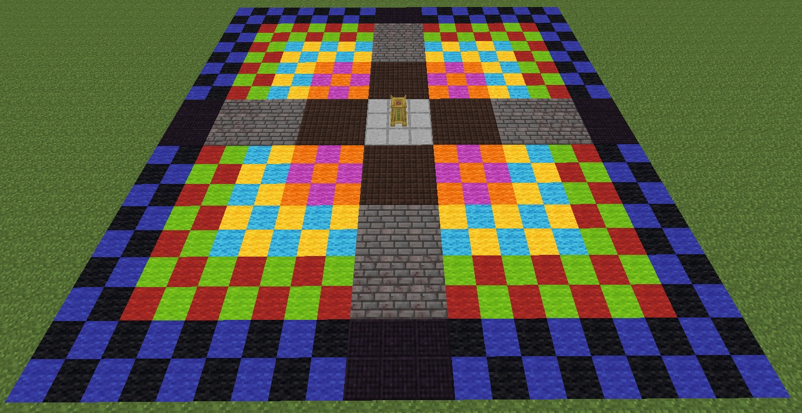

By the time you reach this Tier of blood magic, it hardly seems worth the effort of walking over to your Incense Altar and stabbing yourself. However, Rituals that use a lot of LP can activate a lot in a short period of time, which could lead to a huge shortage of Blood. Maxing out your Incense Altar can give you a maximum boost of 300%, which can fill Altars quickly and could help in a pinch.

With the final Tier of Blood Altar, you will be able to craft Obsidian Paths, this can be used to extend your altar a further 2x3 area.

With the Incense Altar fully upgraded you will have access to a further 128 blocks that can have modifiers placed onto them. This Altar will have a maximum bonus of 300%.